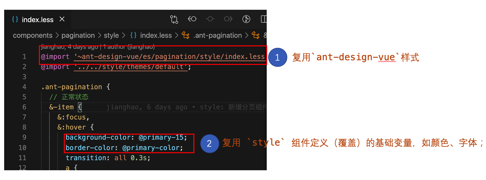
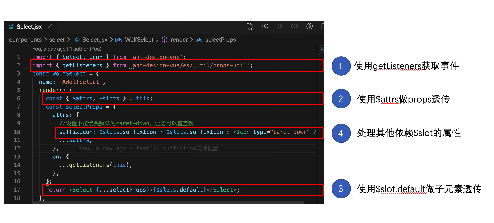
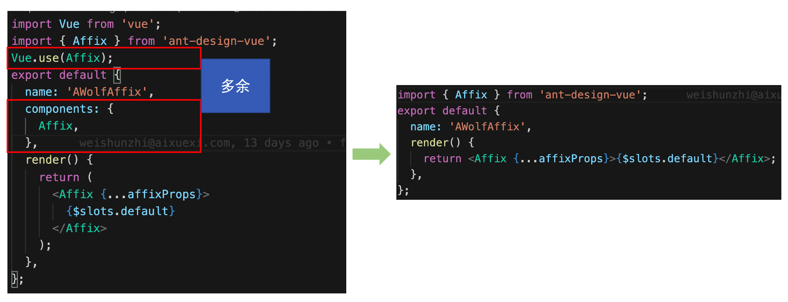

## 组件编写原则

### 约束

- 组件编写使用 `jsx`

  - 不可使用 `template` （编译不支持）,组件 `demo`编写可以使用 `template`

- 组件目录文件约束

  - 组件目录命名，例如：`button`、`table`
  - 子目录格式遵循 `Ant Design Vue` 组件子目录风格，至少要有`demo`、`style`和`index.js`

- demo 路由约束

  - 遵循`Ant Design Vue`中文版路由风格，以`-cn`结尾例如：`how-write-component-cn`、`button-cn`

### 样式处理

- 复用`ant-design-vue`样式，复用 `style` 组件定义（覆盖）的基础变量，如颜色、字体； 

### 复用 ant-design-vue/es/\_util/工具箱

- 'ant-design-vue/es/\_util/props-util'
  - getListeners - 可用于获取事件
  - getOptionProps - 获取 props
  - getClass - 获取样式
  - getComponentName - 获取组件名称
- 工具箱其他内容待整理；todo

### render 函数

- 示意图 
  - 如果有多个插槽，或者需要给插槽传参数请使用\$scopedSlots
    - `const { $scopedSlots } = this;`
- 尽量避免直接使用`createElement`
- 使用`jsx`语法无需做组件注册 
