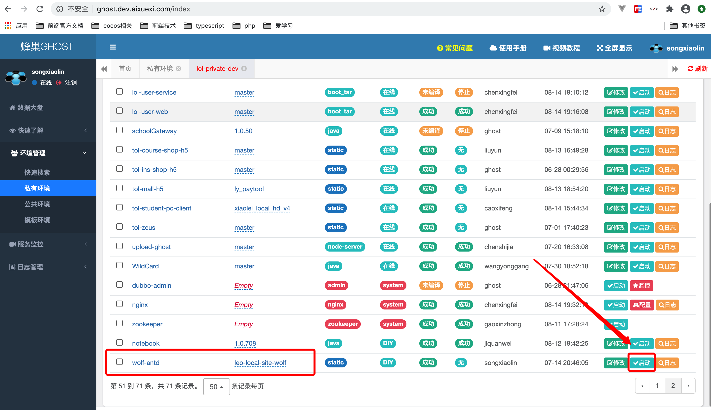

## 如何构建文档

站点地址：<https://wolf.aixuexi.com>

### 1、在命令行中执行一下命令

```bash
$ npm run site
# OR
$ yarn site
```

以上命令会生成 `prod` 静态资源文件夹

### 2、提交到 git 远程仓库；

### 3、在蜂巢环境进行部署，步骤如下：<br />

#### 图一：

#### 图二：
