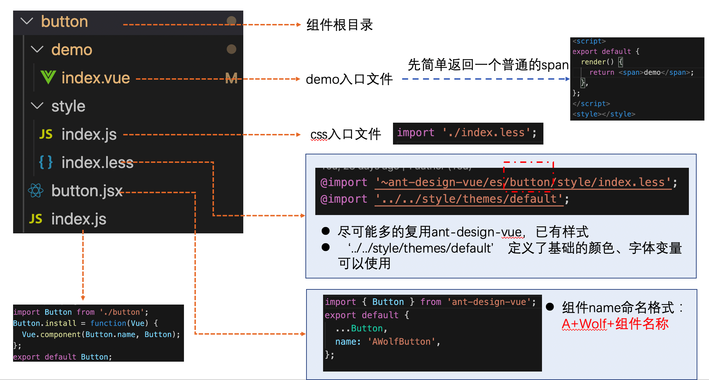
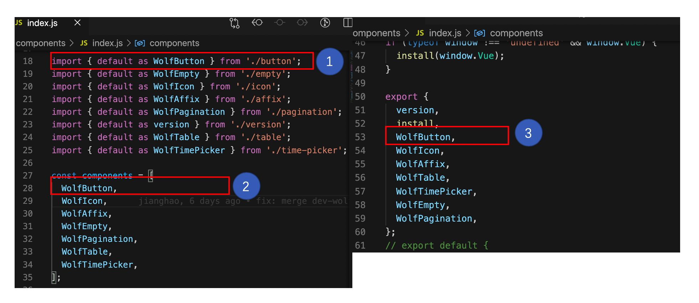
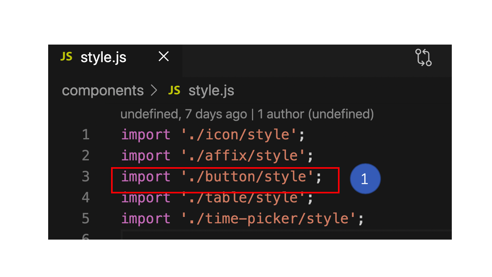

# 如何写组件(以`button`为例)

### 1. 文件目录

- 示意图 

### 2. 组件暴露

- 以`growth-button`组件为例
  - `components/index.js`添加 export 
  - `components/style.js`添加样式引用 

### 3. 指定本地要开发的组件

- `build/config.js`文件修改`componentName`值，例如：指定当前要开发的组件为`growth-button` 

### 4. 启动组件开发本地 sever

- `npm run dev`
