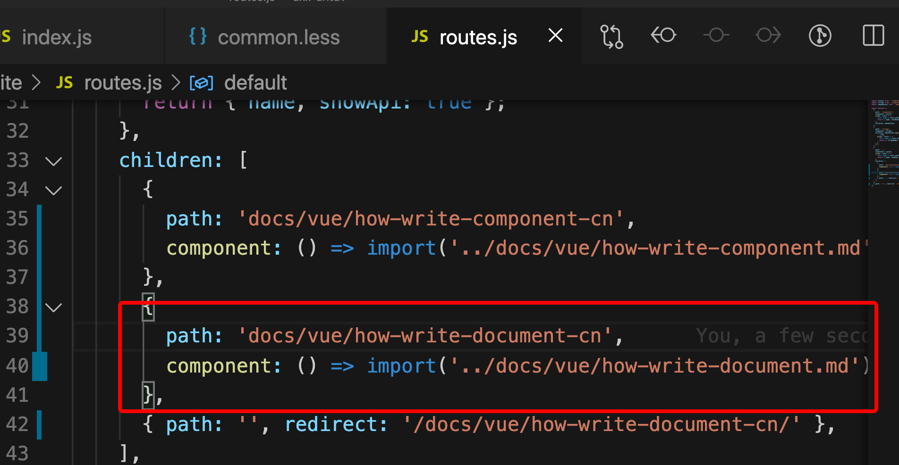
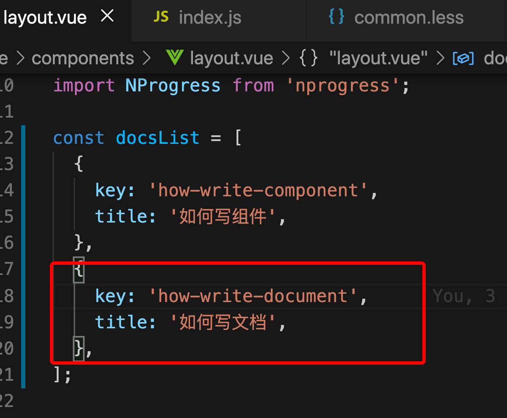

## 如何写文档

- `docs/vue/`目录下新建 markdown 文件，例如`development-process.md`
- `site/routes.js`文件中，添加路由，例如 
- `site/components/layout.vue`文件中，`docsList`添加路由和标题映射(注意不要带`-cn`后缀)，例如 
- 启动 demo 站点本地 sever
  - `npm run start`
